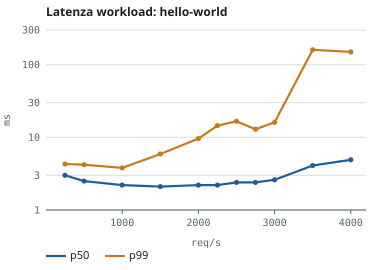
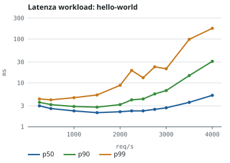
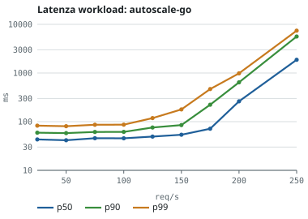
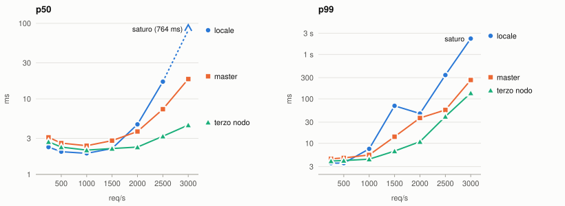
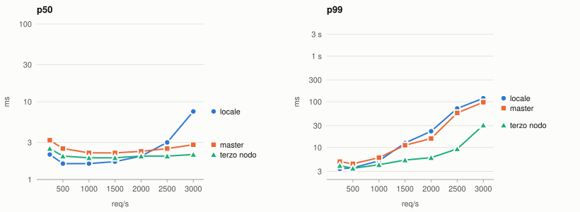

# Test di latenza end-to-end sotto carico crescente
Misurazione latenza end-to-end distinguendo:
- richiesta servita dal **nodo ricevente** (**locale**)
- dal **master** della partizione
- o da un **terzo nodo**

al crescere della concorrenza.

## Indice

- [Risultati in sintesi](#risultati-in-sintesi)
- [Setup](#setup)
- [Considerazione](#considerazione)
- [Metodo di misura](#metodo-di-misura)
- [Risultati: workflow-helloworld](#risultati-workflow-helloworld)
- [Risultati: autoscale-go?prime=5000000](#risultati-autoscale-goprime5000000)
- [Confronto fra locale, master e terzo nodo (configurazione di default)](#confronto-fra-locale-master-e-terzo-nodo-configurazione-di-default)
- [Activator nel percorso dati](#activator-nel-percorso-dati)
- [Confronto fra locale, master e terzo nodo (target-burst-capacity: 0)](#confronto-fra-locale-master-e-terzo-nodo-target-burst-capacity-0)
- [Cold start](#cold-start)

## Risultati in sintesi
Valori misurati sull'intera partizione (confronto per catergoria locale/master/remoto riportato in seguito):
| Metrica | (`workflow baseline: hello-world`) |
|---|---:|
| p50 - mediana | 2-3 ms |
| p99  | 4-6 ms |
| Soglia di saturazione | ~3500-4000 req/s |
| Cold start | 0.6-2.1 s |

La **soglia di saturazione** indica il carico oltre il quale il throughput smette di crescere e la latenza aumenta rapidamente.

Con la configurazione di default l'**activator** di Knative resta nel percorso di ogni richiesta. Togliendolo a regime (`target-burst-capacity: 0`) la latenza sotto carico si riduce nettamente e nessuna destinazione satura più a 3000 req/s (vedi [Activator nel percorso dati](#activator-nel-percorso-dati)).

## Setup

- **Partizione di test**: `edge-node-2` come nodo ricevente, `edge-node-1` come master della partizione, `edge-node-9` come terzo nodo. Per il test è stata usata una routing policy con pesi bilanciati (~34/33/33%). Ogni sito è un cluster k3s a nodo singolo con 4 vCPU e 8 GB di RAM.
- **Funzioni testate**:
  - **Hello world**: `workflow-helloworld`, immagine `ghcr.io/knative/helloworld-go:latest`. Risponde senza alcun calcolo. È il caso di riferimento per isolare l'overhead della sola piattaforma.
  - **Autoscale-go**: `workflow-autoscale`, immagine `ghcr.io/knative/autoscale-go:latest` con `?prime=5000000`: per ogni richiesta la funzione calcola i numeri primi inferiori al parametro impostato e restituisce il più grande. Il tempo di servizio misurato è di circa 40 ms per richiesta, comporta quindi un elevato uso della CPU.
  Questo workload è stato usato per osservare il comportamento dei pod e dell'autoscaler sotto sovraccarico sostenuto.
- **Configurazione Knative**: valori di default. `containerConcurrency: 0` (nessun limite di richieste per pod), KPA di default: 100 richieste concorrenti per pod, scale-to-zero attivo, nessuna richiesta o limite di CPU/memoria sui container della funzione. Traefik (pod `traefik-prism`) in classe `BestEffort`.
Il secondo confronto per categoria usa invece `target-burst-capacity: "0"` (vedi [Activator nel percorso dati](#activator-nel-percorso-dati)).
- **Generazione del traffico**: [vegeta](https://github.com/tsenart/vegeta) eseguito sulla VM `sfcc`. Ogni richiesta apre una connessione TCP nuova (`-keepalive=false`), per simulare sorgenti eterogenee e indipendenti.  

## Considerazione
Inizialmente il carico era generato dal mio pc, collegato ai nodi del testbed via VPN. In quella configurazione il tratto client→Traefik prendeva gran parte della latenza misurata:
- dal pc una singola richiesta a `workflow-helloworld` impiegava circa 93ms, mentre da un nodo interno a SLICES (`sfcc`), la stessa richiesta impiegava 2.6 ms.

## Metodo di misura
- Per ogni livello di rate R, il generatore (`load-test.sh` mediante vegeta) invia R richieste al secondo per 10 secondi. Per ogni richiesta si misura la latenza end-to-end. Si registra anche il throughput effettivo, per vedere se differisce dal rate richiesto.
- Avviene anche monitoraggio dei contatori TCP del nodo ricevente, profondità della coda di accettazione di Traefik e numero di pod pronti per sito.
- **Rilevamento latenza**: la latenza verso il backend per categoria (locale/master/terzo) viene dal campo `Duration` dell'access log JSON di Traefik sul nodo ricevente e identificato mediante `ServiceAddr`. Il tempo di `Duration` copre: rete verso quel nodo, eventuale coda e computazione. Il round-trip completo è invece quello misurato da vegeta e riportato per intero nelle latenze end-to-end delle seguenti sezioni Risultati.

## Risultati: `workflow-helloworld`
Misurazioni su 11 livelli di concorrenza, dati dalla media di 6 ripetizioni.

| Rate (req/s) | p50  (ms) | p90 (ms) | p99 (ms) |
|---:|---:|---:|---:|
| 250  | 3.0 | 3.6  | 4.3   |
| 500  | 2.6 | 3.2  | 4.1   |
| 1000 | 2.3 | 2.9  | 4.6   |
| 1500 | 2.1 | 2.8  | 5.3   |
| 2000 | 2.2 | 3.2  | 8.8   |
| 2250 | 2.3 | 4.1  | 19.2  |
| 2500 | 2.3 | 4.3  | 13.1  |
| 2750 | 2.5 | 5.6  | 23.2  |
| 3000 | 2.7 | 6.7  | 21.0  |
| 3500 | 3.6 | 14.7 | 98.4  |
| 4000 | 5.2 | 31.0 | 175.0 |

- la mediana resta piatta fino a 3000 req/s (2.1-3.0 ms), e sale solo oltre (3.6 ms a 3500, 5.2 ms a 4000).

- L'autoscaler è rimasto a una replica per sito. Con ~2 ms di tempo di servizio, anche a 3000 req/s la concorrenza (richieste aperte nello stesso istante) è di una decina, ben sotto il target di 100 richieste concorrenti per pod che farebbe scalare Knative.

In questa tabella throughput non riportato in quanto corrisponde al rate.

## Risultati: `autoscale-go?prime=5000000`

| Rate (req/s) | Utilizzo | Throughput | p50 (ms) | p90 (ms) | p99 (ms) |
|---:|---:|---:|---:|---:|---:|
| 25  | 0.13 | 25.0  | 43.1  | 59.4   | 82.8   |
| 50  | 0.26 | 49.9  | 41.6  | 58.3   | 80.6   |
| 75  | 0.39 | 74.8  | 45.7  | 61.5   | 86.5   |
| 100 | 0.52 | 99.6  | 45.6  | 61.7   | 86.6   |
| 125 | 0.65 | 124.6 | 49.4  | 75.9   | 118.3  |
| 150 | 0.78 | 149.3 | 53.9  | 85.2   | 178.7  |
| 175 | 0.91 | 173.8 | 71.7  | 222.9  | 467.1  |
| 200 | 1.04 | 193.4 | 262.3  | 642.8  | 985.7  |
| 250 | 1.30 | 171.0 | 1870.2  | 5623.4 | 7415.7 |
 

### Autoscaling durante sovraccarico 

Per osservare pod e autoscaler, `prime=5000000` è stato portato in sovraccarico per 60 secondi (250 req/s) registrando in parallelo i pod pronti per sito.

| Intervallo temporale (s) | Throughput (req/s) | Pod edge-node-2 | Pod edge-node-1 | Pod edge-node-9 |
|---:|---:|---:|---:|---:|
| 0-5   | 197   | 1   | 1   | 1   |
| 5-10  | 94    | 2   | 2   | 1   |
| 10-20 | 66-69 | 4-5 | 3-4 | 2   |
| 20-60 | 4-134 | 6   | 4   | 2-4 |

- Knative scala in base alle richieste concorrenti per pod. In sovraccarico le richieste in volo arrivano a migliaia, l'autoscaler aggiunge pod fino a 14 contemporaneamente.

- **Contesa CPU**: Traefik gira sullo stesso nodo dei pod della funzione, in classe QoS `BestEffort`, sotto contesa riceve la quota minima di CPU. I pod della funzione sono invece `Burstable`, grazie alla piccola richiesta di CPU del sidecar di Knative, e hanno quindi la precedenza. Ingress rimasto senza CPU:
  - le probe di readiness e liveness di Traefik (`/ping`) sono fallite per timeout durante il test
  - la coda di accettazione TCP non si è mai riempita (contatori di overflow a zero), il limite è nella capacità di Traefik di elaborare le connessioni

- **Contesa della memoria**: anche se il calcolo è CPU-bound, ogni richiesta alloca memoria temporanea (nell'ordine di 10-15 MB con `prime=5000000`), liberata solo a fine richiesta. Senza limite di concorrenza (`containerConcurrency: 0`) tutte le richieste in coda entrano nel container e, con la CPU contesa, restano aperte più a lungo, aumentando anche l'occupazione della memoria. Su `edge-node-1` il kernel ha terminato per esaurimento di memoria il processo della funzione, arrivato a circa 4.9 GB degli 8 GB del nodo (il resto era usato da k3s, dallo stack di monitoraggio e dagli altri componenti).

- **Perché l'autoscaler continua ad aggiungere pod**. Knative non guarda la CPU ma le richieste in corso, che valgono circa rate × latenza. Se la latenza sale, le richieste in corso crescono anche a rate costante e l'autoscaler le interpreta come più domanda. Su un nodo singolo si crea un circolo vizioso.
  - il modello di Knative presuppone un cluster multi-nodo, dove un nuovo pod trova CPU libera su un'altra macchina: nei siti PRISM (k3s a nodo singolo) questa ipotesi non vale

_Possibili sviluppi futuri da valutare: un tetto al numero di pod per funzione (`max-scale`), richieste e limiti di CPU e memoria per i pod delle funzioni, QoS `Guaranteed` o priorità più alta per Traefik, un limite di concorrenza per container, oppure un ingresso non condiviso con i pod di calcolo._
 

## Confronto fra locale, master e terzo nodo (configurazione di default)

Per confrontare le tre destinazioni sotto carico, la routing policy è stata impostata al 100% su una sola destinazione alla volta: `edge-node-2` (**locale**), `edge-node-1` (**master**) o `edge-node-9` (**terzo nodo**). Le richieste entrano sempre da `edge-node-2`. \
Il metodo è quello delle altre misurazioni, con 5 ripetizioni per livello verso la funzione `workflow-helloworld`.

_*La linea tratteggiata indica che il valore esce dalla scala del grafico_

Latenza in ms:
| Rate (req/s) | p50 locale | p50 master | p50 terzo nodo | p99 locale | p99 master | p99 terzo nodo |
|---:|---:|---:|---:|---:|---:|---:|
| 250  | 2.3    | 3.1  | 2.7 | 3.6    | 4.5   | 4.0   |
| 500  | 2.0    | 2.6  | 2.3 | 3.6    | 4.7   | 4.1   |
| 1000 | 1.9    | 2.4  | 2.1 | 7.5    | 5.5   | 4.4   |
| 1500 | 2.2    | 2.8  | 2.2 | 69.9   | 14.1  | 6.7   |
| 2000 | 4.6    | 3.7  | 2.3 | 46.7   | 37.2  | 10.9  |
| 2500 | 16.9   | 7.3  | 3.2 | 343.1  | 56.4  | 40.1  |
| 3000 | saturo | 18.3 | 4.5 | saturo | 265.5 | 135.2 |

**p50:**

| Rate req/s | ms Locale  | Δ ms master | Δ ms terzo nodo |
|---:|---:|---:|---:|
| 250  | **2.3**    | +0.8 | +0.4  |
| 500  | **2.0**    | +0.6 | +0.3  |
| 1000 | **1.9**    | +0.5 | +0.2  |
| 1500 | **2.2**    | +0.6 | 0.0   |
| 2000 | **4.6**    | −0.9 | −2.3  |
| 2500 | **16.9**   | −9.6 | −13.7 |
| 3000 | **saturo** | —    | —     |

**p99:**

| Rate req/s | ms Locale  | Δ ms master | Δ ms terzo nodo |
|---:|---:|---:|---:|
| 250  | **3.6**    | +0.9    | +0.4    |
| 500  | **3.6**    | +1.1    | +0.5    |
| 1000 | **7.5**    | −2.0    | −3.1    |
| 1500 | **69.9\*** | −55.8 | −63.2 |
| 2000 | **46.7**   | −9.5    | −35.8   |
| 2500 | **343.1**  | −286.7  | −303.0  |
| 3000 | **saturo** | —       | —       |

\* **saturo** indica che il nodo riceve più richieste di quante riesce a servire (throughput inferiore al rate). Le richieste si accumulano e la latenza cresce senza stabilizzarsi.

- A **basso carico conviene il locale**: ino a 1000-1500 req/s l'ordine è `locale < terzo nodo < master`, con **differenze di pochi decimi di millisecondo**: è il costo del salto di rete verso un altro nodo

- **Sotto carico** l'**ordine si inverte**: in locale `edge-node-2` fa sia ricevente (Traefik accetta e instrada le richieste) sia da esecutore della funzione: p99 comincia a crescere già a 1500 req/s, e a 3000 req/s il nodo è saturo (throughput 2600-2900 req/s). Con una destinazione remota `edge-node-2` fa solo da ricevente e l'esecuzione usa la CPU dell'altro nodo: a 3000 req/s la mediana resta di 4.5 ms (terzo nodo) e 18.3 ms (master).

- Il **master** è **più lento** del **terzo nodo** a ogni livello di carico, pur essendo entrambi remoti. È coerente con l'ipotesi che il master svolga anche lavoro di piano di controllo (aggiornamento dei pesi di routing, osservazione dei siti). _In caso ipotesi da verificare misurando la CPU per processo_.

A basso carico l'esecuzione locale è la più rapida. Sotto carico conviene spostare l'esecuzione su nodi diversi da quello ricevente. Fra le destinazioni remote, il master si è dimostrato meno prestante del terzo nodo.

## Activator nel percorso dati
Osservando la CPU di `edge-node-2` durante il test locale a 2500 req/s, è emerso che la funzione usa una piccola parte della CPU del nodo: il resto va ai componenti che la richiesta attraversa prima di arrivarci.

### Il percorso di una richiesta
Con la configurazione di default ogni richiesta attraversa quattro proxy prima della funzione:
 
`Traefik` → `gateway Kourier` (envoy) → `activator` → `queue-proxy` → funzione
 
L'**activator** di Knative ha due compiti:
- **cold start**: quando la funzione è a zero pod, tiene in attesa le richieste finché il pod non è pronto. Senza activator lo scale-to-zero non può funzionare
- **buffer sotto carico**: con i pod attivi può restare nel percorso per assorbire i picchi. Con `target-burst-capacity` di default (200) e poche repliche, Knative lo tiene **sempre** nel percorso (servizio in modalità `Proxy`)

### CPU per componente
Istantanea di `top` su `edge-node-2` a 2500 req/s, configurazione di default. Nodo occupato al ~94% su 4 core:
 
| Componente | CPU |
|---|---:|
| Traefik | 97% |
| Gateway Kourier (3 processi) | ~80% |
| Activator (2 processi) | ~65% |
| queue-proxy | 57% |
| containerd | ~40% |
| **Funzione** | **21%** |
(un core rappresenta un 100%)
 
- I **proxy consumano circa 3 core su 4**, la funzione un quinto di core
- Durante il test gli **HPA** di Knative hanno aggiunto una replica dell'activator e due del gateway Kourier **sullo stesso nodo** già saturo: più processi e più overhead, non più capacità. Le repliche vengono rimosse qualche minuto dopo il test, quindi ripetizioni successive partono da condizioni diverse

### Caso `target-burst-capacity: 0`
Con `autoscaling.knative.dev/target-burst-capacity: "0"` l'activator interviene **solo durante il cold start**. Con il pod attivo il servizio passa in modalità `Serve` e il traffico va diretto al `queue-proxy`.
- Lo **scale-to-zero resta attivo** (non è stato usato `min-scale: 1`, che lo avrebbe disattivato)
- Per **evitare cold start fra una ripetizione e l'altra** (pausa di 70 s, mentre Knative scala a zero dopo ~60-90 s di inattività): `scale-to-zero-pod-retention-period: "5m"`, che mantiene l'ultimo pod attivo per 5 minuti dopo l'ultima richiesta. L'equivalente Knative del keep-alive tₙ del DRL.

Stesso test (locale, 2500 req/s, 5 ripetizioni) prima e dopo:
 
| Configurazione | p50 (ms) | p90 (ms) | CPU libera sul nodo |
|---|---:|---:|---:|
| Default | 6.3-9.9 | 29-560 | ~14% |
| `target-burst-capacity: 0` | 2.5-3.2 | 8.1-11.9 | ~22% |
 
Circa **mezzo core recuperato** e **latenza mediana ridotta di circa 3 volte**.

## Confronto fra locale, master e terzo nodo (`target-burst-capacity: 0`)
 
Stesso metodo del confronto precedente (routing al 100% su una destinazione, ingresso da `edge-node-2`, 5 ripetizioni, `workflow-helloworld`), con `target-burst-capacity: 0` e pausa di 70 s fra le ripetizioni. \
Nessun caso di destinazione satura.

 
Latenza in ms:
| Rate (req/s) | p50 locale | p50 master | p50 terzo nodo | p99 locale | p99 master | p99 terzo nodo |
|---:|---:|---:|---:|---:|---:|---:|
| 250  | 2.1 | 3.2 | 2.5 | 3.4   | 4.9  | 4.0  |
| 500  | 1.6 | 2.5 | 2.0 | 3.6   | 4.4  | 3.5  |
| 1000 | 1.6 | 2.2 | 1.9 | 5.1   | 6.0  | 4.2  |
| 1500 | 1.7 | 2.2 | 1.9 | 12.5  | 11.2 | 5.3  |
| 2000 | 2.0 | 2.3 | 2.0 | 22.7  | 15.7 | 6.0  |
| 2500 | 3.0 | 2.5 | 2.0 | 71.4  | 57.0 | 9.3  |
| 3000 | 7.5 | 2.8 | 2.1 | 119.6 | 97.8 | 30.8 |
 
**p50:**
 
| Rate req/s | ms Locale | Δ ms master | Δ ms terzo nodo |
|---:|---:|---:|---:|
| 250  | **2.1** | +1.1 | +0.4 |
| 500  | **1.6** | +0.9 | +0.4 |
| 1000 | **1.6** | +0.6 | +0.3 |
| 1500 | **1.7** | +0.5 | +0.2 |
| 2000 | **2.0** | +0.3 | 0.0  |
| 2500 | **3.0** | −0.5 | −1.0 |
| 3000 | **7.5** | −4.7 | −5.4 |
 
**p99:**
 
| Rate req/s | ms Locale | Δ ms master | Δ ms terzo nodo |
|---:|---:|---:|---:|
| 250  | **3.4**   | +1.5  | +0.6  |
| 500  | **3.6**   | +0.8  | −0.1  |
| 1000 | **5.1**   | +0.9  | −0.9  |
| 1500 | **12.5**  | −1.3  | −7.2  |
| 2000 | **22.7**  | −7.0  | −16.7 |
| 2500 | **71.4**  | −14.4 | −62.1 |
| 3000 | **119.6** | −21.8 | −88.8 |
 
- **Stessa gerarchia** di prima a basso carico: `locale < terzo nodo < master`, sotto carico l'ordine si inverte
- Il **salto di rete** verso un altro nodo costa **0.3-0.4 ms** (Δ terzo nodo a basso carico)
- Il **master** resta **più lento del terzo nodo** a ogni livello. La differenza non dipende dall'activator: è un effetto del nodo master. _Ipotesi da verificare misurando la CPU per processo su `edge-node-1` e `edge-node-9` a parità di carico_

### Confronto fra le due configurazioni
 
p50 / p99 in ms, per destinazione:
 
**p50**:
| Rate req/s | Locale default | Locale TBC=0 | Master default | Master TBC=0 | Terzo nodo default | Terzo nodo TBC=0 |
|---:|---:|---:|---:|---:|---:|---:|
| 250  | **2.3**    | −0.2  | **3.1**  | +0.1  | **2.7** | −0.2 |
| 500  | **2.0**    | −0.4  | **2.6**  | −0.1  | **2.3** | −0.3 |
| 1000 | **1.9**    | −0.3  | **2.4**  | −0.2  | **2.1** | −0.2 |
| 1500 | **2.2**    | −0.5  | **2.8**  | −0.6  | **2.2** | −0.3 |
| 2000 | **4.6**    | −2.6  | **3.7**  | −1.4  | **2.3** | −0.3 |
| 2500 | **16.9**   | −13.9 | **7.3**  | −4.8  | **3.2** | −1.2 |
| 3000 | **saturo** |  (7.5 ms)     | **18.3** | −15.5 | **4.5** | −2.4 |

**p99**:
| Rate req/s | Locale default | Locale TBC=0 | Master default | Master TBC=0 | Terzo nodo default | Terzo nodo TBC=0 |
|---:|---:|---:|---:|---:|---:|---:|
| 250  | **3.6**    | −0.2   | **4.5**   | +0.4   | **4.0**   | 0.0    |
| 500  | **3.6**    | 0.0    | **4.7**   | −0.3   | **4.1**   | −0.6   |
| 1000 | **7.5**    | −2.4   | **5.5**   | +0.5   | **4.4**   | −0.2   |
| 1500 | **69.9**   | −57.4  | **14.1**  | −2.9   | **6.7**   | −1.4   |
| 2000 | **46.7**   | −24.0  | **37.2**  | −21.5  | **10.9**  | −4.9   |
| 2500 | **343.1**  | −271.7 | **56.4**  | +0.6   | **40.1**  | −30.8  |
| 3000 | **saturo** | (119.6 ms) | **265.5** | −167.7 | **135.2** | −104.4 |

 
**Sotto carico** il miglioramento è netto su tutte le destinazioni: il **locale non satura più a 3000 req/s** (prima 2600-2900 req/s di throughput massimo), il p99 del terzo nodo a 3000 req/s passa da 135 a 31 ms

Su un nodo edge da 4 core con una funzione leggera, l'activator a regime sposta il punto di saturazione di diverse centinaia di richieste al secondo.

<!-- **Contro** di TBC=0 :
- **Nessun buffer durante lo scale-up**: le richieste in eccesso si accodano sui pod già attivi e non vengono ridistribuite su quelli nuovi
- Bilanciamento fatto dal gateway Kourier, che a differenza dell'activator non conosce le richieste in corso su ogni pod

**Verifica sotto scale-up**: `workflow-autoscale` (`prime=5000000`) su `edge-node-9` a 40 req/s, con scale-up forzato da 1 a ~3 pod (`target: 1`, `max-scale: 4`), 3 ripetizioni per configurazione.

| Configurazione | p50 (ms) | p90 (ms) | p99 (ms) |
|---|---:|---:|---:|
| Default (activator nel percorso) | 40-42 | 58-67 | 105-233 |
| `target-burst-capacity: 0` | 43-44 | 58-69 | 103-211 |

- **Nessuna differenza misurabile**: gli intervalli fra ripetizioni si sovrappongono
- In entrambe le configurazioni l'avvio dei pod produce un picco di pochi secondi, senza errori

_Senza `max-scale` lo stesso test è degenerato: l'autoscaler ha creato pod fino al limite di 110 del nodo, con latenze di decine di secondi. È il circolo vizioso descritto in [Autoscaling durante sovraccarico](#autoscaling-durante-sovraccarico), qui innescato a carico moderato da una soglia di scaling bassa._

_Possibile TODO: inserire `target-burst-capacity: 0` nel template del `function-installer`, così vale per tutte le funzioni PRISM._ -->

## Cold start
La prima richiesta dopo un periodo di inattività paga lo scale-to-zero di Knative: da 0.6 a 2.1 s per `workload-hello` e da 0.8 a 1.7 s per `workload-autoscale`, contro 2-3 ms e 40-45 ms a regime. 

| Funzione | Cold start | A regime |
|---|---:|---:|
| `workflow-helloworld` | 0.6-2.1 s | 2-3 ms |
| `workflow-autoscale` | 0.8-1.7 s | 40-45 ms |
- Il percorso del cold start passa sempre dall'activator, anche con `target-burst-capacity: 0`: i valori valgono per entrambe le configurazioni
